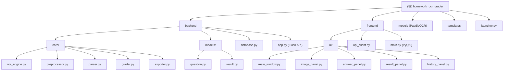

# 手写作业 OCR 自动批改系统

> AI 上下文文档 -- 自动生成于 2026-06-12T21:10:52+0800

## 项目愿景

基于 PaddleOCR 的手写作业自动识别与批改桌面应用，面向教师用户。支持拍照上传作业图片，自动完成文字识别、逐题批改与评分，并提供报告导出和历史记录管理。支持填空题（模糊匹配）、选择题（精确匹配）、计算题（数值比较）三种题型。

---

## 架构总览

系统采用前后端分离的桌面架构：Flask 后端提供 REST API，PyQt5 前端作为 GUI 客户端通过 HTTP 调用后端。`launcher.py` 统一启动器以子进程方式管理后端生命周期。



### 数据流

```
作业图片 -> 上传(POST /api/upload) -> 图像预处理 -> PaddleOCR识别
    -> 文本解析(题号-答案对) -> 逐题批改 -> 结果存入SQLite -> 返回前端展示
```

---

## 模块索引

| 模块 | 路径 | 职责 | 技术栈 |
|------|------|------|--------|
| backend | `backend/` | Flask REST API 服务端，包含 OCR 引擎、批改引擎、数据持久化 | Python, Flask, PaddleOCR, OpenCV, SQLAlchemy, SQLite |
| frontend | `frontend/` | PyQt5 桌面 GUI 客户端，提供图片预览、答案编辑、结果展示、历史查询 | Python, PyQt5, requests |
| models (外部) | `models/` | PaddleOCR v5 预训练模型文件（det + rec），由后端加载 | PaddlePaddle |
| templates | `templates/` | 示例答案模板 JSON 文件 | JSON |
| launcher | `launcher.py` | 统一启动器，管理后端子进程 + 启动前端 GUI | Python subprocess |

---

## 运行与开发

### 环境要求

- Python 3.9+
- Windows 操作系统（打包与 bat 脚本面向 Windows）

### 安装依赖

```bash
pip install -r requirements.txt
```

依赖清单：Flask, flask-cors, SQLAlchemy, PaddlePaddle, PaddleOCR, OpenCV, fuzzywuzzy, python-Levenshtein, numpy, Pillow, PyQt5, requests

### 启动方式

```bash
# 方式一：一键启动（推荐）
python launcher.py

# 方式二：分别启动
cd backend && python app.py    # 后端 http://127.0.0.1:5000
cd frontend && python main.py  # 前端 GUI

# 方式三：Windows 双击
启动系统-windows.bat
```

### 打包

```bash
python build_exe.py
# 输出: dist/HomeworkGrader/HomeworkGrader.exe
```

使用 PyInstaller，配置见 `HomeworkGrader.spec`。

---

## 测试策略

测试位于 `backend/` 目录下，使用 `unittest` 框架：

| 测试文件 | 覆盖模块 | 测试内容 |
|----------|----------|----------|
| `backend/test_grader.py` | `core/grader.py` | 填空题精确/模糊匹配、选择题单选/多选、计算题数值比较/表达式求值 |
| `backend/test_database.py` | `database.py` | 作业保存、批改记录 CRUD、历史检索、统计 |
| `backend/test_parser.py` | `core/parser.py` | 多种题号格式解析、多行答案合并 |

运行测试：

```bash
cd backend
python -m pytest test_grader.py test_database.py test_parser.py -v
# 或
python test_grader.py
python test_database.py
python test_parser.py
```

---

## API 接口一览

后端运行于 `http://127.0.0.1:5000`：

| 方法 | 路径 | 说明 |
|------|------|------|
| GET | `/api/health` | 健康检查 |
| POST | `/api/upload` | 上传作业图片 |
| POST | `/api/preprocess/<file_id>` | 图像预处理 |
| POST | `/api/ocr/<file_id>` | OCR 识别 |
| POST | `/api/parse` | 解析 OCR 结果为题号-答案对 |
| POST | `/api/grade` | 核心批改接口（OCR + 解析 + 评分） |
| POST | `/api/export/<file_id>` | 导出报告（CSV/HTML） |
| GET | `/api/history` | 查询批改历史（支持分页/筛选） |
| GET | `/api/history/<id>` | 批改详情 |
| DELETE | `/api/history/<id>` | 删除批改记录 |
| GET | `/api/statistics` | 统计概览 |

---

## 编码规范

- 语言：Python 3.9+，中文注释与文档字符串
- 类文件头注释格式：`* ClassName class` + 职责说明 + `create by 作者` + `copyright USTC` + `日期`
- 数据类使用 `@dataclass`，枚举使用 `Enum`
- 后端通过 `import config` 引用配置（非包导入，直接引用同目录 config.py）
- 前端同理，各模块通过相对导入引用同目录模块
- 数据库 ORM 使用 SQLAlchemy declarative_base
- 前端面板继承 `QWidget`，主窗口继承 `QMainWindow`
- 题型枚举值：`fill_blank` / `multiple_choice` / `calculation`

---

## 关键配置

**后端配置** (`backend/config.py`)：
- `PORT`: 5000
- `MAX_CONTENT_LENGTH`: 16MB
- `OCR_CONFIDENCE_THRESHOLD`: 0.5
- `FUZZY_MATCH_THRESHOLD`: 80
- `CALCULATION_TOLERANCE`: 0.001
- `DB_NAME`: `homework_grader.db`

**前端配置** (`frontend/config.py`)：
- `API_BASE_URL`: `http://127.0.0.1:5000`

---

## AI 使用指引

- 修改 OCR 相关逻辑时，注意 PaddleOCR 3.x API 使用 `ocr.predict()` 而非 `ocr.ocr()`，返回数据嵌套在 `res` 键下
- 批改引擎的三种题型逻辑各自独立，修改一种题型不影响其他题型
- 数据库 schema 变更需注意 `Base.metadata.create_all()` 不会自动迁移已有表
- 前端 `GradeWorker` 在 QThread 中运行 API 调用，避免阻塞 UI 线程
- 图像预处理流水线顺序：灰度化 -> 降噪 -> 倾斜校正 -> 二值化
- 模型文件位于 `models/PP-OCRv5_server_det/` 和 `models/PP-OCRv5_server_rec/`，首次运行时 PaddleOCR 会尝试从 HuggingFace 下载（已有本地缓存）

---

## 变更记录 (Changelog)

| 时间 | 操作 |
|------|------|
| 2026-06-12T21:10:52+0800 | 初始化 AI 上下文文档，全仓扫描完成 |
