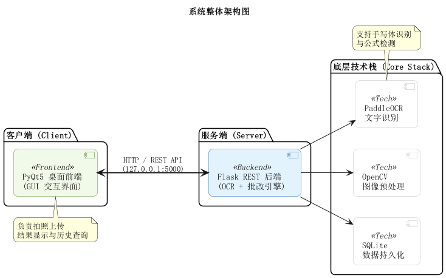
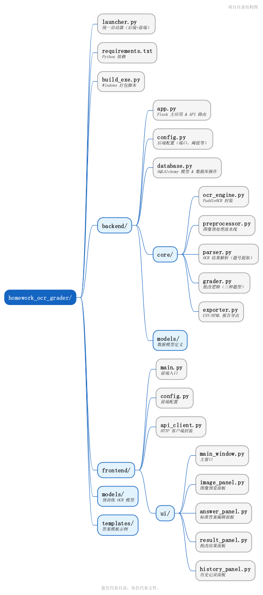

# 手写作业 OCR 自动批改系统

基于 PaddleOCR 的手写作业自动识别与批改桌面应用，面向教师用户，支持拍照上传、文字识别、自动评分和报告导出。

## 系统架构



## 主要功能

- **OCR 识别** — 基于 PaddleOCR v5 识别手写中英文、数字及数学符号
- **三种题型** — 填空题（模糊匹配）、选择题（精确匹配）、计算题（数值比较）
- **图像预处理** — 灰度化、去噪、倾斜校正、二值化，提升识别准确率
- **批量批改** — 支持多份作业连续处理
- **答案模板** — JSON 格式保存/加载标准答案，可复用
- **报告导出** — 支持 CSV 和 HTML（带配色）格式导出
- **历史查询** — 按文件名、日期、分数范围检索批改记录
- **统计概览** — 总批改数、平均分等汇总数据

## 技术栈

| 层级 | 技术 |
|------|------|
| 前端 GUI | PyQt5 5.15+ |
| 后端 API | Flask 3.0+ |
| OCR 引擎 | PaddleOCR 3.4 + PaddlePaddle 2.5+ |
| 图像处理 | OpenCV 4.8+ |
| 模糊匹配 | FuzzyWuzzy + python-Levenshtein |
| 数据库 | SQLite + SQLAlchemy 2.0+ |
| 打包 | PyInstaller |

## 项目结构



## 快速开始

### 环境要求

- Python 3.9+

### 安装依赖

```bash
pip install -r requirements.txt
```

> 首次运行时 PaddleOCR 会自动下载模型文件（约 100MB），后续启动无需重复下载。

### 启动系统

```bash
# 一键启动（推荐，自动启动后端和前端）
python launcher.py
```

也可分别启动：

```bash
# 仅启动后端
cd backend && python app.py

# 仅启动前端（需后端已运行）
cd frontend && python main.py
```

Windows 用户可直接双击 `启动系统.bat`。

### 打包为 Windows 可执行文件

```bash
python build_exe.py
# 输出: dist/HomeworkGrader/HomeworkGrader.exe
```

## 使用流程

1. **上传作业** — 点击"打开图片"或 `Ctrl+O`，选择手写作业照片
2. **设置标准答案** — 在右侧面板添加题目、选择题型、填写标准答案（支持保存/加载模板）
3. **开始批改** — 点击"开始批改"或 `Ctrl+G`，系统自动执行 OCR 识别与评分
4. **查看结果** — 结果面板显示每题的识别文本、标准答案、相似度和得分
5. **导出报告** — 导出为 CSV 或 HTML 格式的批改报告
6. **历史查询** — 切换到历史标签页查看和检索过往批改记录

## 批改规则

| 题型 | 匹配方式 | 说明 |
|------|----------|------|
| 填空题 | 模糊匹配 | 相似度 ≥ 80% 判为正确，自动忽略空格和标点 |
| 选择题 | 精确匹配 | 提取选项字母对比，支持多选和部分得分 |
| 计算题 | 数值比较 | 容差 0.1%，支持数学表达式安全求值 |

## API 接口

后端运行于 `http://127.0.0.1:5000`，主要接口：

| 方法 | 路径 | 说明 |
|------|------|------|
| GET | `/api/health` | 健康检查 |
| POST | `/api/upload` | 上传作业图片 |
| POST | `/api/preprocess/<file_id>` | 图像预处理 |
| POST | `/api/ocr/<file_id>` | OCR 识别 |
| POST | `/api/grade` | 综合批改（OCR + 解析 + 评分） |
| POST | `/api/export/<file_id>` | 导出报告（CSV/HTML） |
| GET | `/api/history` | 查询批改历史 |
| GET | `/api/statistics` | 统计概览 |

## 配置说明

**后端配置** (`backend/config.py`)：

| 配置项 | 默认值 | 说明 |
|--------|--------|------|
| `PORT` | 5000 | 服务端口 |
| `MAX_CONTENT_LENGTH` | 16MB | 上传文件大小限制 |
| `OCR_CONFIDENCE_THRESHOLD` | 0.5 | OCR 置信度阈值 |
| `FUZZY_MATCH_THRESHOLD` | 80 | 模糊匹配相似度阈值 |
| `CALCULATION_TOLERANCE` | 0.001 | 计算题数值容差 |

**前端配置** (`frontend/config.py`)：

| 配置项 | 默认值 | 说明 |
|--------|--------|------|
| `API_BASE_URL` | `http://127.0.0.1:5000` | 后端 API 地址 |

## 支持的图片格式

PNG、JPG、JPEG、BMP、TIFF
