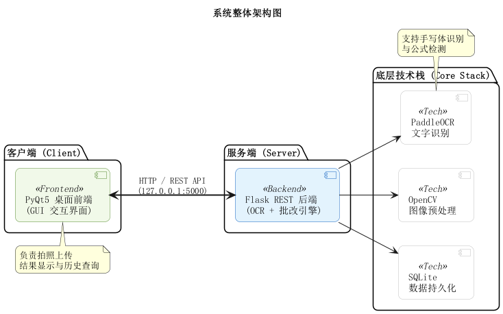
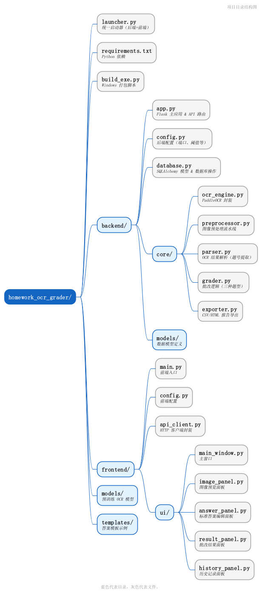

# 手写作业 OCR 自动批改系统

基于 PaddleOCR 的手写作业自动识别与批改桌面应用，面向教师用户，支持拍照上传、文字识别、自动评分和报告导出。

## 系统架构



## 主要功能

- **OCR 识别** — 基于 PaddleOCR v6 识别手写中英文、数字及数学符号
- **AI 纠错** — 可选启用 LLM（OpenAI 兼容接口）纠正 OCR 识别错误，并智能匹配题号
- **三种题型** — 填空题（模糊匹配）、选择题（精确匹配）、计算题（数值比较，支持中文符号归一化）
- **双匹配模式** — 题号匹配（默认）与位置匹配（解决嵌套题号撞号问题）
- **图像预处理** — 灰度化、去噪、倾斜校正、二值化，提升识别准确率
- **答案模板** — JSON 格式保存/加载标准答案，可复用
- **报告导出** — 支持 CSV 和 HTML（带配色）格式导出
- **历史查询** — 按文件名、日期、分数范围检索批改记录
- **统计概览** — 总批改数、平均分等汇总数据
- **图形化设置** — 可视化配置 LLM API Key、模型、超时，支持测试连接

## 技术栈

| 层级 | 技术 |
|------|------|
| 前端 GUI | PyQt5 5.15+ |
| 后端 API | Flask 3.0+ |
| OCR 引擎 | PaddleOCR 3.7 (PP-OCRv6) + PaddlePaddle 3.0+ |
| AI 纠错 | OpenAI 兼容 LLM（DeepSeek / OpenAI 等） |
| 图像处理 | OpenCV 4.8+ |
| 模糊匹配 | FuzzyWuzzy + python-Levenshtein |
| 数据库 | SQLite + SQLAlchemy 2.0+ |
| 打包 | PyInstaller |

## 项目结构



## 快速开始

### 环境要求

- Python 3.9+

### 安装依赖

```bash
pip install -r requirements.txt
```

> 项目已内置 PP-OCRv6 模型（`models/PP-OCRv6_medium_*`，约 134MB），开箱即用无需联网下载。
>
> **关于 clone**：模型文件通过 Git LFS 管理。clone 后若已安装 [Git LFS](https://git-lfs.com/)，模型会随仓库一起下载（推荐）；若未安装 LFS，首次启动时系统会自动检测并从官方源下载模型，不影响使用。

### 启动系统

```bash
# 一键启动（推荐，自动启动后端和前端）
python launcher.py
```

也可分别启动：

```bash
# 仅启动后端
cd backend && python app.py

# 仅启动前端（需后端已运行）
cd frontend && python main.py
```

Windows 用户可直接双击 `启动系统.bat`。

### 打包为 Windows 可执行文件

```bash
python build_exe.py
# 输出: dist/HomeworkGrader/HomeworkGrader.exe
```

## 使用流程

1. **上传作业** — 点击"打开图片"或 `Ctrl+O`，选择手写作业照片
2. **设置标准答案** — 在右侧面板添加题目、选择题型、填写标准答案（支持保存/加载模板）
3. **(可选) 选择匹配模式** — 题号匹配（默认）或位置匹配（适合嵌套题号作业）
4. **(可选) 启用 AI 纠错** — 勾选后由 LLM 纠正 OCR 错误并智能匹配答案（需在设置页配置 API Key）
5. **开始批改** — 点击"开始批改"或 `Ctrl+G`，系统自动执行 OCR 识别与评分
6. **查看结果** — 结果面板显示每题的识别文本、标准答案、相似度和得分
7. **导出报告** — 导出为 CSV 或 HTML 格式的批改报告
8. **历史查询** — 切换到历史标签页查看和检索过往批改记录

## 批改规则

| 题型 | 匹配方式 | 说明 |
|------|----------|------|
| 填空题 | 模糊匹配 | 相似度 ≥ 80% 判为正确，自动忽略空格和标点 |
| 选择题 | 精确匹配 | 提取选项字母对比，支持多选和部分得分 |
| 计算题 | 数值比较 | 容差 0.1%，支持数学表达式求值，自动归一化中文符号与数字 |

### 匹配模式说明

| 模式 | 适用场景 | 原理 |
|------|----------|------|
| **题号匹配**（默认） | 题号唯一、结构简单的作业 | 按题号对应标准答案 |
| **位置匹配** | 嵌套题号（①②③、第7题下(1)(2)）的作业 | 识别答案与标准答案从上到下一一对应，多退少补 |
| **AI 纠错**（可选增强） | 追求最高准确率 | LLM 纠正 OCR 错误并按语义匹配，需配置 API Key |

## API 接口

后端运行于 `http://127.0.0.1:5000`，主要接口：

| 方法 | 路径 | 说明 |
|------|------|------|
| GET | `/api/health` | 健康检查 |
| POST | `/api/upload` | 上传作业图片 |
| POST | `/api/preprocess/<file_id>` | 图像预处理 |
| POST | `/api/ocr/<file_id>` | OCR 识别 |
| POST | `/api/grade` | 综合批改（OCR + 解析 + 评分，支持 AI 纠错与匹配模式） |
| POST | `/api/export/<file_id>` | 导出报告（CSV/HTML） |
| GET | `/api/history` | 查询批改历史 |
| GET | `/api/statistics` | 统计概览 |
| GET/PUT | `/api/settings` | 读取/更新 LLM 配置 |
| POST | `/api/settings/test` | 测试 LLM 连接 |

## 配置说明

**后端配置** (`backend/config.py`)：

| 配置项 | 默认值 | 说明 |
|--------|--------|------|
| `PORT` | 5000 | 服务端口 |
| `MAX_CONTENT_LENGTH` | 16MB | 上传文件大小限制 |
| `OCR_CONFIDENCE_THRESHOLD` | 0.5 | OCR 置信度阈值 |
| `FUZZY_MATCH_THRESHOLD` | 80 | 模糊匹配相似度阈值 |
| `CALCULATION_TOLERANCE` | 0.001 | 计算题数值容差 |

**前端配置** (`frontend/config.py`)：

| 配置项 | 默认值 | 说明 |
|--------|--------|------|
| `API_BASE_URL` | `http://127.0.0.1:5000` | 后端 API 地址 |

**LLM 配置**（通过设置页图形化配置，持久化到 `~/.homework_grader/settings.json`）：

| 配置项 | 说明 |
|--------|------|
| API Key | LLM 服务商的密钥 |
| Base URL | 留空用默认；DeepSeek 填 `https://api.deepseek.com` |
| 模型名 | 如 `deepseek-chat`、`gpt-4o-mini` |
| 超时 | 默认 30 秒 |

## 支持的图片格式

PNG、JPG、JPEG、BMP、TIFF
