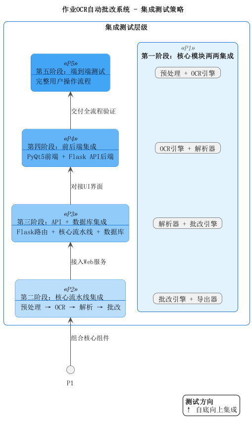

# 作业OCR自动批改系统 — 集成测试计划

## 1. 引言

### 1.1 测试目的

验证系统各模块之间的接口交互、数据传递和协作功能的正确性，确保模块组合后系统能够按照设计要求正常运行。

### 1.2 测试范围

| 集成层次 | 测试内容 |
|---------|---------|
| 核心模块集成 | OCR引擎 + 预处理 + 解析器 + 批改引擎 |
| API集成 | Flask路由 + 核心模块 + 数据库 |
| 前后端集成 | PyQt5前端 + Flask API后端 |
| 端到端集成 | 完整业务流程 |

### 1.3 测试环境

| 项目 | 说明 |
|------|------|
| 操作系统 | Windows 10 / macOS |
| Python | >= 3.8 |
| 数据库 | SQLite（使用独立测试数据库） |
| OCR模型 | PP-OCRv5_server_det / rec |
| 测试框架 | pytest |

---

## 2. 集成测试策略

采用 **自底向上** 集成策略：

---

## 3. 第一阶段：核心模块两两集成

### IT-1.1 预处理 + OCR引擎

| 编号 | 测试用例 | 输入 | 预期结果 | 优先级 |
|------|---------|------|---------|--------|
| IT-1.1.1 | 预处理后图片送入OCR | 正常作业照片 | OCR能成功识别出文字，结果非空 | 高 |
| IT-1.1.2 | 倾斜图片预处理后OCR | 倾斜15°的作业照片 | 纠偏后OCR识别率不低于正常图片 | 中 |
| IT-1.1.3 | 低质量图片预处理后OCR | 模糊/噪声较多的图片 | 去噪后OCR能识别出主要文字 | 中 |
| IT-1.1.4 | 预处理输出格式兼容性 | 任意图片 | preprocess()输出的numpy数组能被recognize()接受 | 高 |

### IT-1.2 OCR引擎 + 解析器

| 编号 | 测试用例 | 输入 | 预期结果 | 优先级 |
|------|---------|------|---------|--------|
| IT-1.2.1 | OCR结果正确解析 | 包含题号的OCR结果列表 | parse_answers()返回正确的题号-答案映射 | 高 |
| IT-1.2.2 | 多行答案合并 | OCR结果中答案跨行 | 同一题号的多行文本正确合并 | 高 |
| IT-1.2.3 | 空OCR结果 | 空列表 | parse_answers()返回空字典 | 中 |
| IT-1.2.4 | 无题号文本 | 全部无法匹配题号 | 返回空字典，不抛异常 | 中 |

### IT-1.3 解析器 + 批改引擎

| 编号 | 测试用例 | 输入 | 预期结果 | 优先级 |
|------|---------|------|---------|--------|
| IT-1.3.1 | 填空题批改 | 解析结果含填空题答案 + 标准答案 | 正确返回匹配结果和分数 | 高 |
| IT-1.3.2 | 选择题批改 | 解析结果含选择题答案 | 正确判断选项是否一致 | 高 |
| IT-1.3.3 | 计算题批改 | 解析结果含计算结果 | 正确进行数值比较 | 高 |
| IT-1.3.4 | 混合题型批改 | 包含三种题型 | 各题型分别正确评分，汇总正确 | 高 |
| IT-1.3.5 | 题号不匹配 | 解析结果缺少某题答案 | 缺失题计0分，不影响其他题 | 中 |

### IT-1.4 批改引擎 + 导出器

| 编号 | 测试用例 | 输入 | 预期结果 | 优先级 |
|------|---------|------|---------|--------|
| IT-1.4.1 | 批改结果导出CSV | GradingReport结果 | CSV格式正确，含所有题目和汇总 | 高 |
| IT-1.4.2 | 批改结果导出HTML | GradingReport结果 | HTML格式正确，颜色标注正确 | 高 |
| IT-1.4.3 | 空结果导出 | 空的GradingReport | 导出文件只有表头和汇总行 | 低 |

---

## 4. 第二阶段：核心流水线集成

### IT-2 完整批改流水线

| 编号 | 测试用例 | 输入 | 预期结果 | 优先级 |
|------|---------|------|---------|--------|
| IT-2.1 | 完整流水线-全对 | 学生答案全部正确的作业图片 + 标准答案 | 得分率100% | 高 |
| IT-2.2 | 完整流水线-全错 | 学生答案全部错误的作业图片 + 标准答案 | 得分率0% | 高 |
| IT-2.3 | 完整流水线-部分正确 | 混合正确和错误答案 | 得分率在0%-100%之间，各题判断正确 | 高 |
| IT-2.4 | 完整流水线-手写体 | 手写作业图片 | OCR能识别大部分文字，批改结果合理 | 中 |
| IT-2.5 | 完整流水线-印刷体 | 印刷体作业图片 | 识别准确率高，批改结果准确 | 高 |
| IT-2.6 | 流水线性能 | 标准测试图片 | 整体处理时间 < 30秒 | 中 |

---

## 5. 第三阶段：API + 数据库集成

### IT-3.1 上传 + 数据库

| 编号 | 测试用例 | 输入 | 预期结果 | 优先级 |
|------|---------|------|---------|--------|
| IT-3.1.1 | 上传后查询数据库 | POST /api/upload | homeworks表新增记录，file_id一致 | 高 |
| IT-3.1.2 | 重复上传同一文件 | 同一文件上传两次 | 生成不同file_id，两条记录 | 中 |

### IT-3.2 批改 + 数据库

| 编号 | 测试用例 | 输入 | 预期结果 | 优先级 |
|------|---------|------|---------|--------|
| IT-3.2.1 | 批改结果持久化 | POST /api/grade | grading_records和question_results表新增记录 | 高 |
| IT-3.2.2 | 批改后查询历史 | 批改后 GET /api/history | 能查到刚才的批改记录 | 高 |
| IT-3.2.3 | 批改详情查询 | GET /api/history/<id> | 返回完整的题目详情 | 高 |
| IT-3.2.4 | 同一作业多次批改 | 同一file_id多次batch | 产生多条grading_records | 中 |

### IT-3.3 历史查询 + 数据库

| 编号 | 测试用例 | 输入 | 预期结果 | 优先级 |
|------|---------|------|---------|--------|
| IT-3.3.1 | 关键词搜索 | keyword="数学" | 返回文件名含"数学"的记录 | 高 |
| IT-3.3.2 | 日期范围过滤 | date_from, date_to | 返回指定日期范围内的记录 | 高 |
| IT-3.3.3 | 分数范围过滤 | min_score=60, max_score=100 | 返回得分率在60%-100%的记录 | 高 |
| IT-3.3.4 | 分页查询 | page=2, per_page=10 | 返回第二页数据，total正确 | 中 |
| IT-3.3.5 | 删除后查询 | 删除记录后查询 | 被删除的记录不再出现 | 高 |

### IT-3.4 导出API集成

| 编号 | 测试用例 | 输入 | 预期结果 | 优先级 |
|------|---------|------|---------|--------|
| IT-3.4.1 | CSV导出API | POST /api/export, format=csv | 返回有效CSV内容 | 高 |
| IT-3.4.2 | HTML导出API | POST /api/export, format=html | 返回有效HTML内容 | 高 |

---

## 6. 第四阶段：前后端集成

### IT-4 前端APIClient + 后端API

| 编号 | 测试用例 | 操作 | 预期结果 | 优先级 |
|------|---------|------|---------|--------|
| IT-4.1 | 健康检查连通性 | APIClient.health_check() | 返回 {"status": "ok"} | 高 |
| IT-4.2 | 前端上传图片 | APIClient.upload_image(path) | 成功返回file_id | 高 |
| IT-4.3 | 前端发起批改 | APIClient.grade(file_id, questions) | 返回完整批改结果 | 高 |
| IT-4.4 | 前端查询历史 | APIClient.get_history() | 返回分页历史记录 | 高 |
| IT-4.5 | 前端删除记录 | APIClient.delete_grading(id) | 删除成功，再查询不到 | 中 |
| IT-4.6 | 后端未启动时 | 调用任何API | 前端捕获连接异常，不崩溃 | 高 |
| IT-4.7 | 大文件上传 | 上传接近16MB的图片 | 上传成功 | 低 |
| IT-4.8 | 超大文件上传 | 上传超过16MB的文件 | 返回错误提示，前端正常处理 | 中 |

---

## 7. 第五阶段：端到端测试

### IT-5 完整业务流程

| 编号 | 测试用例 | 操作步骤 | 预期结果 | 优先级 |
|------|---------|---------|---------|--------|
| IT-5.1 | 完整批改流程 | 1.启动系统 2.打开图片 3.设置答案 4.批改 5.查看结果 | 全流程无报错，结果正确显示 | 高 |
| IT-5.2 | 导出流程 | 批改完成后导出CSV和HTML | 文件保存成功，内容与界面一致 | 高 |
| IT-5.3 | 历史查询流程 | 批改后切换到历史页查询 | 能查到刚才的记录，详情正确 | 高 |
| IT-5.4 | 模板加载批改 | 1.加载答案模板 2.打开图片 3.批改 | 模板答案正确加载，批改正常 | 中 |
| IT-5.5 | 多次批改 | 连续批改3张不同作业 | 每次批改结果独立正确，历史记录3条 | 中 |
| IT-5.6 | 删除后重新批改 | 删除历史记录后重新批改 | 删除成功，新批改不受影响 | 低 |

---

## 8. 测试数据准备

### 8.1 测试图片

| 编号 | 描述 | 用途 |
|------|------|------|
| img_01 | 印刷体填空题作业（3题） | 基础功能测试 |
| img_02 | 印刷体选择题作业（5题） | 选择题测试 |
| img_03 | 手写体混合题目作业 | 手写识别测试 |
| img_04 | 倾斜拍摄的作业照片 | 纠偏功能测试 |
| img_05 | 低分辨率模糊图片 | 预处理效果测试 |
| img_06 | 超大尺寸图片(>16MB) | 异常输入测试 |
| img_07 | 空白图片 | 边界条件测试 |

### 8.2 测试答案模板

| 编号 | 描述 | 题目组成 |
|------|------|---------|
| tmpl_01 | 基础填空题模板 | 3道填空题 |
| tmpl_02 | 基础选择题模板 | 5道选择题 |
| tmpl_03 | 混合题型模板 | 2填空+2选择+1计算 |

---

## 9. 缺陷严重级别定义

| 级别 | 定义 | 示例 |
|------|------|------|
| 致命 | 系统崩溃或核心功能完全不可用 | 批改流程报500错误 |
| 严重 | 核心功能结果错误 | 评分计算错误、数据库写入失败 |
| 一般 | 非核心功能异常 | 导出格式有误、历史分页不准 |
| 轻微 | 界面显示问题 | 状态栏信息不准确 |

---

## 10. 测试通过标准

1. 所有 **高优先级** 测试用例100%通过
2. **中优先级** 测试用例通过率 ≥ 90%
3. 无 **致命** 或 **严重** 级别缺陷遗留
4. 完整批改流程端到端测试通过
