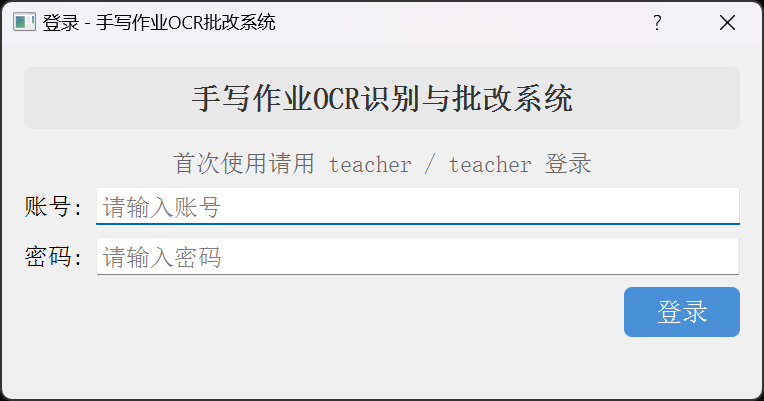
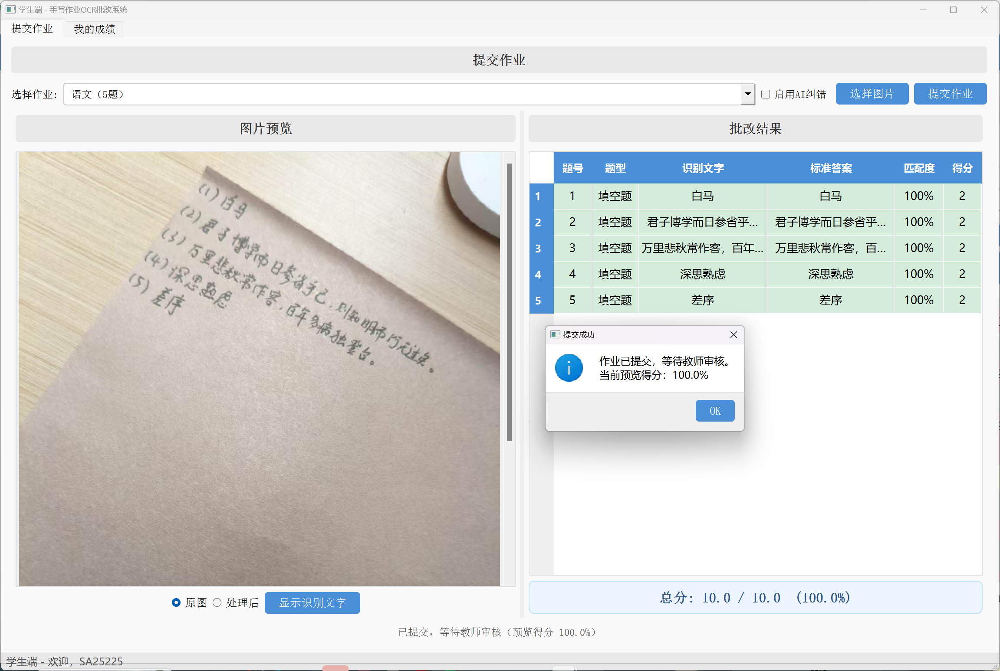
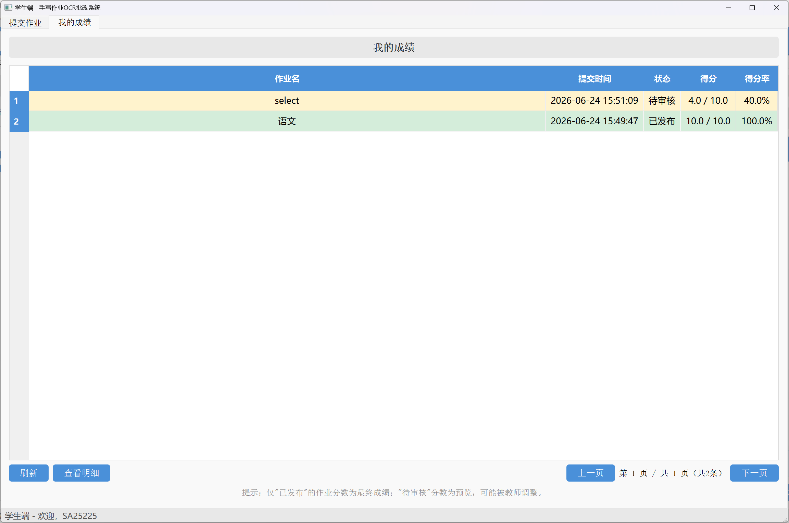
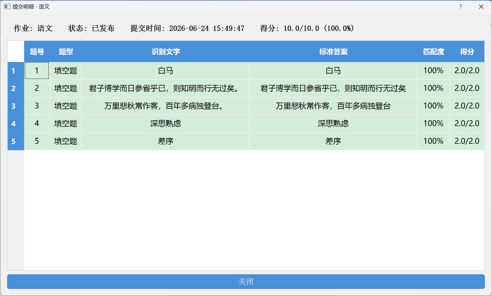

# 手写作业OCR识别与批改系统 —— 学生使用手册

## 一、系统介绍

本系统让你（学生）用手写作业的**照片**提交作业，系统会自动识别你写的内容并批改，给出预览分数。老师审核发布后，你就能在"我的成绩"里看到最终成绩。

简单流程：

```
登录 → 选作业 → 拍照上传 → 系统自动批改(预览) → 等老师审核 → 我的成绩查最终分数
```

---

## 二、启动与登录

- Windows：双击项目文件夹中的 **"启动系统.bat"**。
- 启动后弹出登录窗口。
- 输入老师给你的**账号**和**密码**，点 **"登录"**。
- 登录成功后进入**学生端**，顶部状态栏显示"学生端 - 欢迎，{你的姓名}"。



> 账号由老师创建，你自己无法注册。忘了账号或密码请找老师。

---

## 三、提交作业

学生端有 **"提交作业"** 和 **"我的成绩"** 两个页面。提交一份作业的步骤：



### 1. 选择作业

在"提交作业"页顶部的 **"选择作业"** 下拉框里，选老师布置的作业（框里会显示作业名和题数，如"第一章练习（5题）"）。

> 如果下拉框是空的，或提示"暂无可提交的作业"，说明老师还没开放作业，请联系老师。

### 2. 选择图片

点 **"选择图片"**，选你拍好的作业照片（支持 PNG / JPG / BMP / TIFF）。照片会在左侧预览，并自动上传。

### 3. 提交

点 **"提交作业"**。系统会自动识别并批改（大约几秒），完成后弹出提示：

> 作业已提交，等待教师审核。当前预览得分：X%

右侧同时显示每道题的批改预览（识别文字 / 标准答案 / 匹配度 / 得分），底部显示预览总分。

**请注意：**
- 这时的分数是**预览**，老师还可能调整，不是最终成绩。
- 状态显示"等待教师审核"，直到老师发布为止。

### （可选）启用 AI 纠错

提交前勾选 **"启用AI纠错"**，可提高识别准确率（看老师是否允许使用）。

---

## 四、我的成绩

切到 **"我的成绩"** 页，可以查看自己所有的提交。

表格列：作业名 / 提交时间 / 状态 / 得分 / 得分率。

| 状态 | 含义 | 底色 |
|------|------|------|
| **待审核** | 老师还没发布，分数只是预览，可能被调整 | 黄色 |
| **已发布** | 老师已确认，**这是最终成绩** | 绿色 |

> 只有"已发布"的才是最终成绩；"待审核"的分数仅供参考。



**查看每题明细**：选中一行，点 **"查看明细"**（或直接双击），弹窗里显示该次提交每道题的识别文字、标准答案、匹配度、得分，方便你对照哪里丢了分。



**翻页 / 刷新**：底部有"上一页 / 下一页"（每页 15 条）；点 **"刷新"** 可获取老师最新发布的成绩。

---

## 五、拍照规范（重要！）

识别准不准，很大程度看照片拍得好不好。请按下面的要求拍摄，能明显减少误判：

**书写：**
1. 每道题前写清题号（`1.` `2.` 或 `(1)` `(2)` 等）。
2. 字迹工整，别太小、别太潦草。
3. 选择题直接写字母 A / B / C / D。
4. 计算题在等号后面写清结果，如 `3+5=8`。

**拍照：**

| 要求 | 说明 |
|------|------|
| 光线 | 充足均匀，别有阴影、反光 |
| 角度 | 手机正对试卷，别歪斜 |
| 清晰 | 文字要清楚，别拍糊 |
| 完整 | 所有题目都要拍进画面 |
| 背景 | 桌面尽量干净，减少干扰 |

---

## 六、常见问题

**Q：登录失败怎么办？**
账号和密码由老师创建。请确认账号密码输入无误；忘了就找老师。

**Q：下拉框里选不到作业？**
说明老师还没开放作业，请联系老师。

**Q：提交后分数很低，但我明明写对了？**
预览分数是基于自动识别的，照片不清晰或字迹潦草会影响识别。可在"我的成绩"查看明细，看是哪一题识别错了。**最终成绩以老师审核发布为准**，老师会人工复核。

**Q：分数为什么显示"—"？**
"待审核"且尚未生成预览时可能暂时显示"—"，稍等或刷新即可。

**Q：能重新提交吗？**
按老师规定。一般每次提交都会记录在案，老师会审核你的提交。

**Q：提交后发现写错了，能改吗？**
提交后自己无法修改，需要联系老师处理。

**Q：怎么看最终成绩？**
"我的成绩"里状态为 **"已发布"** 的那一条就是最终成绩。
