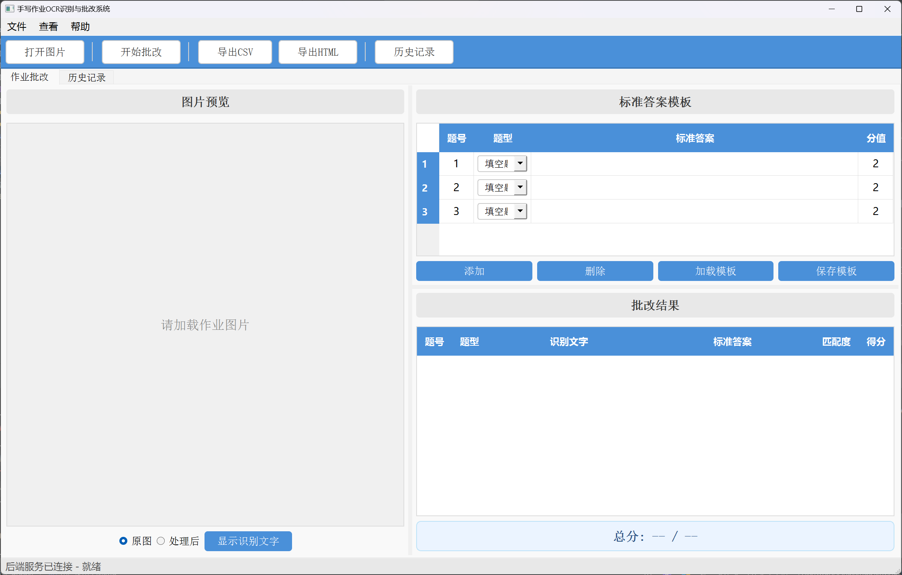

# 手写作业OCR识别与批改系统 —— 教师使用手册

## 一、系统介绍

本系统帮助教师批改学生手写作业，支持**教师端**与**学生端**双角色协同：

- **教师（您）**：维护作业（标准答案集合）、为学生开通账号、审核学生提交、必要时手动改分并发布成绩。
- **学生**：登录后选择作业、拍照上传，系统自动 OCR 批改生成预览；您审核发布后，学生即可查看最终成绩。

完整教学闭环：

```
教师创建作业(标准答案) → 教师为学生开通账号 → 学生选作业+拍照上传(自动批改，待审核)
                       → 教师在"待审核"复核/改分 → 发布 → 学生"我的成绩"可见
```

此外，教师端保留 **"作业批改"** 页，方便您不走学生流程、自己拍一张当场批改（演示或临时批改用）。

**核心能力：**
- 识别手写中文、英文、数字、数学符号
- 自动批改填空题（模糊匹配）、选择题（精确匹配）、计算题（数值比较）
- AI 纠错（可选，LLM 纠正识别错误 + 智能匹配题号）
- 位置匹配（解决嵌套题号撞号）
- 历史记录、统计、CSV/HTML 报告导出

---

## 二、启动与登录

### 启动

- Windows：双击项目文件夹中的 **"启动系统.bat"**（或命令行 `python launcher.py`）。
- 系统已内置 PP-OCRv6 识别模型（约 134MB，随项目附带），开箱即用，无需联网下载。

### 登录

启动后先弹出**登录窗口**：

- 系统内置一个默认教师账号：**账号 `teacher`，密码 `teacher`**。首次使用请用它登录。
- 输入账号、密码，点 **"登录"**（或回车）。登录成功后自动进入**教师端主窗口**。

> 身份通过请求头标识，密码明文存储（本课程项目简化处理，未做哈希/令牌）。

---

## 三、教师端界面总览

教师端主窗口顶部有 **5 个标签页（Tab）**：

| Tab | 用途 |
|----|------|
| **作业批改** | 教师"现批现改"：拍一张作业直接 OCR + 批改（不经过学生提交流），也用于演示。 |
| **作业管理** | 维护"作业"——把一套标准答案存起来供学生选择提交。新建/编辑/开放关闭/删除。 |
| **待审核** | 查看学生提交，复核、手动改分、发布成绩。 |
| **账号管理** | 为学生（或教师）创建、删除登录账号。 |
| **历史记录** | 查询所有批改记录（含现批现改与学生提交审核的）。 |

工具栏：打开图片(Ctrl+O) · 开始批改(Ctrl+G) · 导出CSV · 导出HTML · 历史记录(Ctrl+H) · 设置。

**建议的首次使用顺序**：账号管理（建学生账号）→ 作业管理（建一份作业）→ 学生端提交 → 待审核（发布）。

---

## 四、账号管理（为学生开通账号）

学生需要账号才能登录学生端提交作业。账号由教师创建，学生无法自行注册。

1. 切到 **"账号管理"** Tab。
2. 在上方 **"新建账号"** 区填写：
   - **账号**：学生登录名，如 `stu01`
   - **密码**：学生登录密码
   - **姓名**：可选，显示用；不填则默认同账号
   - **角色**：选 **学生**（也可新建教师）
3. 点 **"新建"**，提示成功后即可把账号密码发给学生。

下方账号列表支持：
- 按**角色筛选**（仅学生 / 仅教师 / 全部）、**刷新**。
- 选中一行点 **"删除选中"** 可删除账号（会二次确认）。

> 删除账号不影响已产生的批改记录，但该账号将无法再登录。

---

## 五、作业管理（维护标准答案）

"作业"是一套持久化的标准答案，学生提交时从中选择。作业有 **"开放" / "已关闭"** 两种状态——只有**开放**的作业学生端才显示、才能提交。

### 新建作业

1. 切到 **"作业管理"** Tab，点 **"新建作业"**（右侧编辑区清空）。
2. 填 **"作业名"**（如"第一章练习"）。
3. 在右侧题目表格添加题目：题号 / 题型 / 标准答案 / 分值。

**不同题型的答案怎么填：**

| 题型 | 答案填写方式 | 举例 |
|------|-------------|------|
| 填空题 | 直接写正确答案 | "北京"、"光合作用"、"长方形" |
| 选择题 | 写正确选项字母 | 单选"B"，多选"AC" |
| 计算题 | 写最终计算结果 | "15"、"3.5"、"100" |

4. 点 **"保存作业"**，提示成功。

### 编辑 / 开放关闭 / 删除

- 左侧列表选中一个作业，右侧自动载入其题目供编辑，改完点 **"保存作业"**。
- **"切换开放状态"**：在"开放"↔"已关闭"之间切换。关闭后学生端不再显示该作业。
- **"删除选中"**：删除作业及其所有学生提交（不可恢复，会二次确认）。

> 学生端"提交作业"下拉框里看到的作业，正是这里状态为"开放"的作业。

---

## 六、作业批改（现批现改）

当你不想走"学生提交 → 审核"的完整流程，只想自己拍一张作业当场批改（或做演示）时，用这个页面。



### 操作步骤

1. **打开图片**：工具栏 **"打开图片"**（Ctrl+O），选作业照片。左侧显示预览并自动上传。
2. **填写标准答案**：右上方题目表格添加题目（题号/题型/答案/分值）。
   - 也可复用作业管理里建好的作业作为参考。
   - 支持 **保存模板** / **加载模板**（JSON 文件，便于复用）。
3. **（可选）匹配模式**：题号匹配（默认）/ 位置匹配（适合嵌套题号，按答案从上到下顺序对应）。
4. **（可选）启用 AI 纠错**：勾选后调用 LLM 纠正识别错误并智能匹配题号。首次需在 **"设置"** 里配置 API Key / Base URL / 模型名（支持 DeepSeek、OpenAI 等兼容服务），可"测试连接"。
5. **开始批改**：工具栏 **"开始批改"**（Ctrl+G）。系统自动预处理 → OCR 识别 → 对比评分，约 **3~10 秒**。
6. **查看结果**：右下方结果区显示每题识别文字 / 标准答案 / 匹配度 / 得分；**绿色**=正确、**红色**=错误；底部显示总分。
7. **（可选）导出报告**：导出CSV（Excel 可开）/ 导出HTML（浏览器可打印）。

### 批改多份同类作业（批量技巧）

现批现改模式下，要批一个班的同一套卷子时：

1. 先填好标准答案（或 **加载模板**）。
2. 打开第 1 个学生作业 → 开始批改 → 看结果。
3. 打开第 2 个 → 答案不用重填（还在表格里）→ 直接开始批改。依此类推。
4. 每次结果自动进"历史记录"。

> 如果走学生提交流，则不需要这样逐张批——学生各自提交、您在"待审核"集中处理即可。

---

## 七、待审核（审核学生提交、改分、发布）

学生提交作业后，系统自动 OCR 批改生成**预览**，状态为 **待审核**。您需要在此复核、必要时手动改分，然后**发布**——发布后学生才能在"我的成绩"看到。

### 1. 查看待审核

切到 **"待审核"** Tab。左侧列表默认筛选 **"仅待审核"**（可切换为"仅已发布"/"全部"），列：ID / 学生 / 作业 / 提交时间 / 状态 / 得分率。点 **"刷新"** 更新。

### 2. 查看明细

选中左侧一行，右侧自动载入该提交的每题批改明细（识别文字 / 标准答案 / 匹配度 / 得分）。

### 3. 手动改分（可选）

- 在右侧结果表里直接修改某题的"得分"/"是否正确"。
- 点 **"保存改分"** → 系统按改动重算总分。提示"改分已保存（尚未发布）"。
- 可连续多次保存，以最后一次为准。

### 4. 发布

- 确认无误后点 **"发布"**。
- 二次确认：**发布后成绩对学生可见，且不可撤回为待审核**。
- 发布成功后状态变为 **已发布**，学生"我的成绩"即可查看。

> 待审核期间学生看到的只是预览分数，**发布后的才是最终成绩**。

---

## 八、历史记录

记录所有批改（含现批现改与学生提交审核）。

- 进入：工具栏 **"历史记录"**（Ctrl+H）。
- 搜索：按 文件名 / 日期范围 / 得分率范围 筛选，点搜索；刷新清空条件。
- 双击一行：弹出详情，看每题结果。
- 删除：选中 → 删除记录。
- 列表颜色：**绿**（≥80%）、**黄**（60~80%）、**红**（<60%）。
- 底部：总作业数 / 总批改数 / 平均得分率。

---

## 九、作业拍照规范（请转告学生）

识别效果很大程度取决于照片质量，建议要求学生：

**书写：**
1. 规范题号：`1.` `2.` / `1、` `2、` / `(1)` `(2)` 等清晰格式。
2. 字迹工整，不要太小、太潦草。
3. 选择题直接写 A/B/C/D。
4. 计算题在等号后写清最终结果，如 `3+5=8`。

**拍照：**

| 要求 | 说明 |
|------|------|
| 光线 | 充足均匀，避免阴影、反光 |
| 角度 | 尽量正对试卷，不要倾斜 |
| 清晰 | 文字清楚，不模糊 |
| 完整 | 所有题目都拍进画面 |
| 背景 | 桌面干净，减少干扰 |

---

## 十、快捷键

| 按键 | 功能 |
|------|------|
| Ctrl+O | 打开图片 |
| Ctrl+G | 开始批改 |
| Ctrl+H | 历史记录 |
| Ctrl+Q | 退出系统 |

---

## 十一、常见问题

**Q：启动后显示"后端服务未启动"？**
关闭后重新双击"启动系统.bat"。仍失败请检查 Python 与依赖是否安装正确。

**Q：首次启动特别慢？**
首次需加载识别模型，可能 1~3 分钟，属正常；之后每次几秒。

**Q：登录失败？**
默认教师账号 `teacher / teacher`。学生账号由您在"账号管理"创建，学生无法自行注册。

**Q：学生端看不到作业？**
检查"作业管理"里该作业是否为**开放**状态——关闭的作业学生端不显示。

**Q：学生提交了，但我在"待审核"看不到？**
确认筛选不是"仅已发布"；点"刷新"。

**Q：识别结果和学生写的不一样？**
照片质量、字迹、倾斜都会影响识别。建议让学生重拍；复杂作业可启用 AI 纠错。识别不完全准确时建议人工复核——这正是"待审核"改分功能的用途。

**Q：填空题学生写对了却判错？**
填空题用模糊匹配，相似度 ≥ 80% 判对。识别误差导致误判时，可在"待审核"手动改分。

**Q：发布后能撤回吗？**
不能撤回为待审核。发布前请确认分数无误。

**Q：批改记录存在哪里？会丢吗？**
`backend/homework_grader.db`（SQLite）。只要不删该文件，记录就不会丢。建议定期备份。

---

## 十二、作业 / 答案模板文件说明

作业与模板本质都是题目列表的 JSON 文件，熟悉文本编辑也可直接用记事本编辑：

```json
{
  "questions": [
    {"number": 1, "type": "fill_blank", "answer": "北京", "points": 2.0},
    {"number": 2, "type": "multiple_choice", "answer": "B", "points": 2.0},
    {"number": 3, "type": "multiple_choice", "answer": "AC", "points": 3.0},
    {"number": 4, "type": "calculation", "answer": "15", "points": 3.0}
  ]
}
```

| 字段 | 含义 | 可选值 |
|------|------|--------|
| number | 题号 | 1, 2, 3... |
| type | 题型 | `fill_blank`(填空) / `multiple_choice`(选择) / `calculation`(计算) |
| answer | 标准答案 | 任意文本 |
| points | 分值 | 任意数字 |

项目的 `templates/sample_template.json` 有一份示例供参考。
