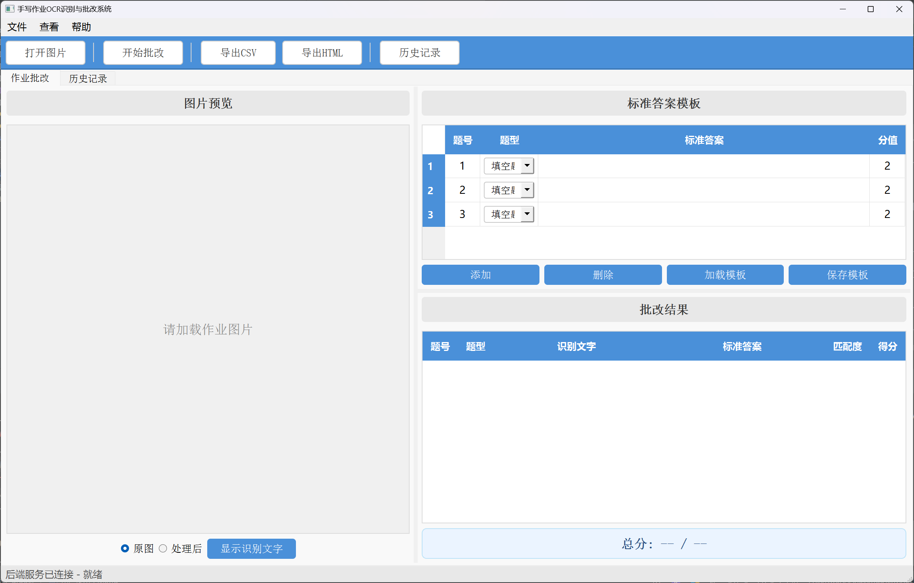

# 手写作业OCR识别与批改系统 —— 教师使用手册

## 一、系统介绍

本系统帮助教师快速批改学生的手写作业。只需将作业拍照上传，系统会自动识别学生书写的内容，对照您设定的标准答案进行逐题批改，给出每题的得分和总成绩。

**能做什么：**
- 识别学生手写的中文、英文、数字和数学符号
- 自动批改填空题、选择题和简单计算题
- 即使学生字迹不够工整，也能通过模糊匹配进行容错判断
- 自动保存每次批改记录，方便以后查阅和统计
- 导出批改报告（Excel表格或网页格式），可打印存档

---

## 二、启动系统

### Windows用户

双击项目文件夹中的 **"启动系统.bat"** 文件，等待几秒钟后系统界面会自动弹出。

首次启动时，系统需要下载文字识别模型（约100MB），请保持网络连接，耐心等待。下载完成后，以后每次启动都会很快。

### 界面说明

启动后您会看到如下界面，分为两个页面，通过顶部标签页切换：

**"作业批改"页面（主页面）：**



**"历史记录"页面：** 查看和搜索过去所有的批改记录。

---

## 三、批改一份作业（分步指引）

### 第一步：拍照并加载图片

1. 将学生作业平放在桌上，用手机拍照
2. 将照片传到电脑上
3. 点击工具栏 **"打开图片"** 按钮，选择照片文件

**拍照小贴士：**
- 光线要充足，不要有阴影遮住文字
- 手机尽量正对试卷，不要歪斜太多
- 确保学生的手写内容拍清楚了
- 支持的照片格式：PNG、JPG、BMP、TIFF

加载成功后，左侧会显示作业图片的预览。

### 第二步：填写标准答案

在界面右上方的 **"标准答案模板"** 表格中，填写每道题的信息：

| 需要填的内容 | 怎么填 | 举例 |
|------------|--------|------|
| **题号** | 填数字，要和试卷上的题号对应 | 1、2、3 |
| **题型** | 点击下拉框选择 | 填空题 / 选择题 / 计算题 |
| **标准答案** | 填写这道题的正确答案 | 见下方说明 |
| **分值** | 填写这道题的满分是多少 | 2、3、5 |

**不同题型的答案怎么填：**

| 题型 | 答案填写方式 | 举例 |
|------|-------------|------|
| 填空题 | 直接写正确答案 | "北京"、"光合作用"、"长方形" |
| 选择题 | 写正确选项的字母 | 单选填"B"，多选填"AC" |
| 计算题 | 写最终的计算结果 | "15"、"3.5"、"100" |

**操作提示：**
- 点击 **"添加"** 按钮可以增加新的一行
- 选中某一行后点击 **"删除"** 可以删掉它
- 如果题目较多，可以点击 **"保存模板"** 把答案存成文件，下次直接 **"加载模板"** 就行

### 第三步：开始批改

点击工具栏 **"开始批改"** 按钮。

系统会自动完成以下工作：
1. 对图片进行预处理（去噪、纠正倾斜）
2. 识别图片中学生手写的文字
3. 将识别结果与每道题的标准答案进行对比
4. 计算每题得分和总分

整个过程大约需要 **3~10秒**，请耐心等待。批改过程中，底部状态栏会显示"正在识别与批改中，请稍候..."。

### 第四步：查看批改结果

批改完成后，右下方 **"批改结果"** 区域会显示每道题的结果：

| 显示内容 | 含义 |
|---------|------|
| 识别文字 | 系统从学生手写内容中识别出的文字 |
| 标准答案 | 您之前设定的正确答案 |
| 匹配度 | 识别结果和标准答案有多接近（100%=完全一致） |
| 得分 | 这道题学生实际得了多少分 |

**结果颜色含义：**
- **绿色** = 回答正确
- **红色** = 回答错误

最下方显示 **总分**，例如："总分: 7.0 / 10.0 (70.0%)"

### 第五步：导出报告（可选）

如果需要保存或打印批改结果：
- 点击 **"导出CSV"** —— 生成Excel可以打开的表格文件，方便做成绩统计
- 点击 **"导出HTML"** —— 生成网页格式的报告，用浏览器打开后可以直接打印

---

## 四、批改多份作业（批量操作技巧）

当您需要批改一个班的同一套试卷时：

1. 先填好标准答案，点击 **"保存模板"** 存为文件
2. 打开第一个学生的作业图片 → 点击"开始批改" → 查看结果
3. 打开第二个学生的作业图片 → 答案不用重新填（还在表格里）→ 直接点"开始批改"
4. 以此类推，逐个批改
5. 所有结果会自动保存在"历史记录"中

如果中途关闭了系统，下次使用时点击 **"加载模板"** 导入之前保存的答案文件即可继续。

---

## 五、查看历史记录

系统会自动保存每一次批改的完整记录。

### 进入历史页面

点击工具栏 **"历史记录"** 按钮，或按键盘 **Ctrl+H**。

### 搜索特定记录

历史记录页面顶部提供了搜索条件，帮助您快速找到需要的记录：

| 搜索条件 | 用途 | 使用举例 |
|---------|------|---------|
| 文件名 | 按照片文件名搜索 | 输入"张三"找到张三的作业 |
| 日期范围 | 按批改日期筛选 | 选择本周的日期，查看本周批改的作业 |
| 得分率范围 | 按成绩筛选 | 设置0%~60%，筛选出不及格的作业 |

填好条件后点击 **"搜索"** 即可。点击 **"刷新"** 可以清空条件，显示全部记录。

### 查看某次批改的详情

在列表中 **双击** 某条记录，会弹出详情窗口，显示当时每道题的批改结果。

### 删除记录

选中一条记录，点击 **"删除记录"** 按钮，确认后即可删除。

### 列表颜色含义

- **绿色** = 得分率 80% 以上（优秀）
- **黄色** = 得分率 60%~80%（及格）
- **红色** = 得分率 60% 以下（不及格）

### 统计信息

页面底部自动显示汇总数据：一共批改了多少份作业、批改了多少次、全班平均得分率是多少。

---

## 六、作业拍照规范

为了让系统获得最好的识别效果，请指导学生按以下规范书写和拍照：

### 学生书写要求

1. **使用规范题号**：每道题前写清楚题号，推荐以下格式：
   - `1.` `2.` `3.` （数字加句点）
   - `1、` `2、` `3、`（数字加顿号）
   - `(1)` `(2)` `(3)`（数字加括号）
2. **书写工整清晰**：字不要太小，笔画不要太潦草
3. **选择题写清选项字母**：直接写A、B、C、D
4. **计算题写出结果**：在等号后面写清楚最终答案，如 `3+5=8`

### 拍照要求

| 要求 | 说明 |
|------|------|
| 光线 | 充足均匀，避免阴影和反光 |
| 角度 | 手机正对试卷，尽量不要倾斜 |
| 清晰度 | 文字要拍清楚，不要模糊 |
| 完整性 | 把所有题目都拍进画面内 |
| 背景 | 桌面尽量干净，减少干扰 |

---

## 七、快捷键

| 按键 | 功能 |
|------|------|
| Ctrl+O | 打开图片 |
| Ctrl+G | 开始批改 |
| Ctrl+H | 查看历史记录 |
| Ctrl+Q | 退出系统 |

---

## 八、常见问题与解答

### 问：系统启动后显示"后端服务未启动"怎么办？

请关闭系统，重新双击"启动系统.bat"。如果仍然失败，请检查电脑上是否正确安装了Python和所有依赖。

### 问：第一次启动特别慢，是正常的吗？

是的。首次启动时系统需要下载文字识别模型，这个过程可能需要1~3分钟，取决于网速。下载完成后，以后每次启动只需几秒钟。

### 问：OCR识别出来的文字和学生写的不一样怎么办？

这通常是因为：
- 照片拍得不够清晰 → 重新拍一张更清楚的照片
- 学生字迹太潦草 → 系统有一定的容错能力，但过于潦草的字迹确实难以识别
- 试卷倾斜太严重 → 系统能自动纠正小角度倾斜，但大角度需要重新拍照

目前识别不完全准确时，建议教师对照结果进行人工复核。

### 问：填空题学生写对了，但系统判错了？

系统对填空题使用模糊匹配，只要识别文字和标准答案的相似度达到80%就判为正确。如果因为识别误差导致误判，您可以在查看结果后手动记录正确的分数。

### 问：如何批改同一套试卷的多份作业？

请参考本手册"四、批改多份作业"部分。核心方法是：先保存答案模板，然后逐个打开学生作业图片进行批改，标准答案不需要重复设置。

### 问：批改记录保存在哪里？会不会丢失？

所有批改记录保存在系统目录下的数据库文件中（`backend/homework_grader.db`）。只要不删除这个文件，历史记录就不会丢失。建议定期备份此文件。

### 问：可以导出全班的成绩汇总吗？

目前系统支持逐次导出批改报告（CSV或HTML格式）。您可以将每次导出的CSV文件汇总到一个Excel表格中，制作全班成绩单。

---

## 九、答案模板文件说明

答案模板是一个JSON格式的文本文件，如果您熟悉文本编辑，也可以直接用记事本编辑：

```json
{
  "questions": [
    {"number": 1, "type": "fill_blank", "answer": "北京", "points": 2.0},
    {"number": 2, "type": "fill_blank", "answer": "长方形", "points": 2.0},
    {"number": 3, "type": "multiple_choice", "answer": "B", "points": 2.0},
    {"number": 4, "type": "multiple_choice", "answer": "AC", "points": 3.0},
    {"number": 5, "type": "calculation", "answer": "15", "points": 3.0},
    {"number": 6, "type": "calculation", "answer": "24", "points": 3.0}
  ]
}
```

**字段说明：**
| 字段 | 含义 | 可选值 |
|------|------|--------|
| number | 题号 | 1, 2, 3... |
| type | 题型 | `fill_blank`(填空)、`multiple_choice`(选择)、`calculation`(计算) |
| answer | 标准答案 | 任意文本 |
| points | 分值 | 任意数字 |

项目的 `templates/sample_template.json` 文件中有一份示例模板供参考。
