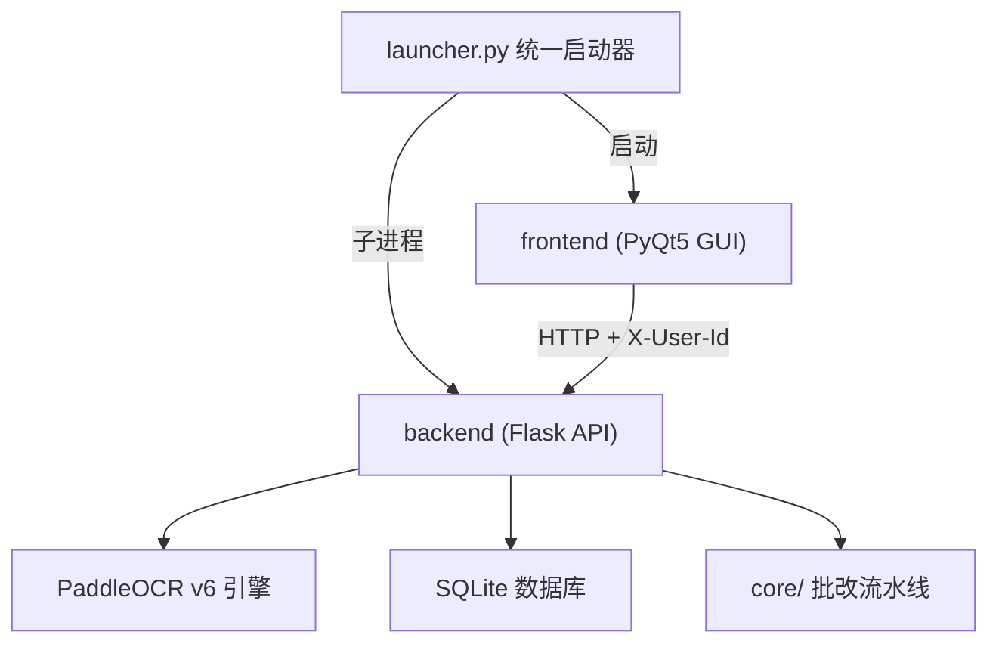

# 代码说明

> 手写作业 OCR 自动批改系统 · 工程实践结题材料
> 本文档面向代码评审与答辩，说明系统的整体架构、各模块职责、关键算法与实现细节。

---

## 一、项目概述

本系统是一套**手写作业自动识别与批改的桌面应用**，帮助教师批改学生手写作业。系统支持**教师端**与**学生端**双角色协同：教师维护作业（标准答案集合）、审核学生提交并发布成绩；学生选择作业、拍照上传，系统自动 OCR 识别并批改。

**核心能力：**

- 基于 PaddleOCR v6 识别手写中文、英文、数字、数学符号
- 自动批改**填空题**（模糊匹配）、**选择题**（精确匹配）、**计算题**（数值比较）
- **AI 纠错**（可选）：调用 LLM 纠正 OCR 识别错误并智能匹配题号
- **位置匹配**：解决嵌套题号撞号问题
- 完整的教学闭环：教师建作业 → 学生提交 → 教师审核改分发布 → 学生查看成绩
- 历史记录、统计概览、CSV/HTML 报告导出

---

## 二、系统架构

系统采用**前后端分离的桌面架构**：Flask 后端提供 REST API，PyQt5 前端作为 GUI 客户端通过 HTTP 调用后端。`launcher.py` 统一启动器以子进程方式管理后端生命周期，并在前端启动时弹出登录框、按账号角色开窗。



**技术栈：**

| 层级 | 技术 |
|------|------|
| 前端 GUI | PyQt5 5.15+ |
| 后端 API | Flask 3.0+ + flask-cors |
| OCR 引擎 | PaddleOCR 3.7 (PP-OCRv6) + PaddlePaddle 3.0+ |
| AI 纠错 | OpenAI 兼容 LLM（DeepSeek / OpenAI 等） |
| 图像处理 | OpenCV 4.8+ + numpy |
| 模糊匹配 | FuzzyWuzzy + python-Levenshtein |
| 数据库 | SQLite + SQLAlchemy 2.0+ |
| 打包 | PyInstaller |

**双角色设计：** 启动时 `app_bootstrap.run_app()` 弹出登录框，登录成功后按角色开窗——教师开 `MainWindow`（5 个功能页），学生开 `StudentMainWindow`（2 个功能页）。身份通过 HTTP 头 `X-User-Id` 标识。

---

## 三、目录结构

```
homework_ocr_grader/
├── backend/                 # 后端 Flask 服务
│   ├── app.py               # Flask 应用入口，所有 API 路由
│   ├── config.py            # 后端配置常量
│   ├── database.py          # SQLAlchemy ORM 模型与数据库操作
│   ├── settings_store.py    # LLM 配置本地持久化
│   ├── core/                # 核心处理流水线
│   │   ├── ocr_engine.py    #   PaddleOCR 封装（单例）
│   │   ├── preprocessor.py  #   图像预处理
│   │   ├── parser.py        #   OCR 文本解析
│   │   ├── grader.py        #   批改引擎
│   │   ├── llm_corrector.py #   LLM 纠错 Agent
│   │   └── exporter.py      #   报告导出
│   ├── models/              # 业务数据类
│   │   ├── question.py      #   Question / QuestionType / OcrResult
│   │   └── result.py        #   QuestionResult / GradingReport
│   └── test_*.py            # 单元测试
├── frontend/                # 前端 PyQt5 GUI
│   ├── main.py              # 入口，委托 app_bootstrap
│   ├── app_bootstrap.py     # QApplication / 登录 / 按角色开窗
│   ├── api_client.py        # 后端 API HTTP 客户端
│   ├── config.py            # 前端配置
│   └── ui/                  # 各 UI 面板
│       ├── main_window.py / student_main_window.py
│       ├── login_dialog.py / assignment_panel.py / review_panel.py
│       ├── user_manage_panel.py / submission_panel.py / my_grades_panel.py
│       └── image_panel.py / answer_panel.py / result_panel.py / history_panel.py
├── models/                  # PaddleOCR v6 预训练模型（det + rec）
├── ocr_eval/                # 独立 OCR 评估工具包（不参与运行时批改）
├── templates/               # 示例答案模板
├── launcher.py              # 统一启动器
└── build_exe.py             # PyInstaller 打包脚本
```

---

## 四、后端模块说明（backend/）

### 4.1 入口与配置

- **app.py**：Flask 应用，定义全部 REST API 路由（鉴权、作业、提交、批改、历史等）。核心批改逻辑抽取为 `_run_grading_pipeline()`，被 `/api/grade` 与 `/api/submissions` 共用。
- **config.py**：集中管理端口、上传限制、OCR 与批改阈值等常量。

| 配置项 | 默认值 | 说明 |
|--------|--------|------|
| `PORT` | 5000 | 服务端口 |
| `MAX_CONTENT_LENGTH` | 16MB | 上传大小限制 |
| `OCR_CONFIDENCE_THRESHOLD` | 0.5 | OCR 置信度过滤 |
| `FUZZY_MATCH_THRESHOLD` | 80 | 填空题模糊匹配阈值 |
| `CALCULATION_TOLERANCE` | 0.001 | 计算题数值容差（0.1%） |

### 4.2 OCR 引擎（core/ocr_engine.py）

PaddleOCR 的单例封装，使用项目内置的 PP-OCRv6 模型（det + rec）。`recognize(image)` 返回按位置排序的结果列表——先按 Y 坐标分行，行内按 X 排序，保证阅读顺序正确。使用 PaddleOCR 3.x 的 `predict()` API。

### 4.3 图像预处理（core/preprocessor.py）

预处理流水线，提升识别准确率：

```
灰度化 → 降噪(fastNlMeansDenoising) → 倾斜校正(Canny+HoughLinesP) → 自适应二值化
```

倾斜校正通过 Canny 边缘检测 + Hough 直线检测计算倾角并旋转补偿。

### 4.4 文本解析（core/parser.py）

用正则表达式从 OCR 文本中提取题号与答案，支持五种题号格式：

- `(1)` / `（1）` 括号格式
- `第1题` 格式
- `例1` 格式
- `1.` / `1、` / `1)` 格式
- `1．` 全角句点格式

支持多行答案合并（续行内容追加到当前题号）。

### 4.5 批改引擎（core/grader.py）

三种题型各自独立的批改逻辑，修改一种不影响其他：

| 题型 | 方法 | 匹配策略 |
|------|------|----------|
| 填空题 | `grade_fill_blank()` | 文本归一化 → 精确匹配 → 备选答案 → fuzz.ratio(≥80%) → fuzz.partial_ratio(≥90%, ×0.9 系数) |
| 选择题 | `grade_multiple_choice()` | 提取 A–F 字母集合 → 精确匹配 → 多选部分得分（子集且无错误选项，50% 系数） |
| 计算题 | `grade_calculation()` | 数学符号归一化 → 等号后提取数值 → 纯数字解析 → AST 安全表达式求值 → 数值比较（容差 0.1%） |

计算题归一化已支持中文符号（"等于"→"="）与中文数字（一二三→123）。

### 4.6 LLM 纠错（core/llm_corrector.py）

LLM 纠错 Agent 承担**双职责**：

1. **纠错**：纠正 OCR 识别中的错别字、形近字
2. **匹配**：理解题目结构，智能匹配识别文本到对应题号

配置（API Key / Base URL / 模型 / 超时）通过图形化设置页填写，持久化到 `~/.homework_grader/settings.json`，启动时覆盖 `config.py` 默认值。

### 4.7 报告导出（core/exporter.py）

- `export_csv()`：UTF-8-BOM 编码，Excel 可直接打开
- `export_html()`：带配色（正确绿 / 错误红）的 HTML 报告，浏览器可打印

### 4.8 数据持久化（database.py）

使用 SQLAlchemy ORM，共 6 张表：

| 表 | 关键字段 | 说明 |
|----|----------|------|
| `users` | username, password(明文), role, display_name | 账号；role = teacher / student |
| `assignments` | name, teacher_id, questions_json, status | 作业（标准答案集合）；status = active / closed |
| `submissions` | assignment_id, student_id, grading_id, status | 学生提交；status = pending / published |
| `homeworks` | file_id, 原始/存储文件名, uploader_id | 上传的作业图片 |
| `grading_records` | 关联 homework, total/earned/percentage | 一次批改记录 |
| `question_results` | 关联 grading, 题号, 识别文本, 得分 | 每题批改结果 |

**关系：** Homework 1:N GradingRecord 1:N QuestionResultRecord；Assignment 1:N Submission（级联删除）。

数据库初始化 `init_db()` 包含 schema 迁移（`_migrate_schema()` 为老表补 `uploader_id` 列）与默认账号播种（`_seed_default_users()` 首次插入 `teacher/teacher`）。

### 4.9 批改流水线

`_run_grading_pipeline(filepath, questions_data, override_*)` 是核心，统一执行：

```
图像预处理 → PaddleOCR 识别 → (可选)LLM 纠错 → 文本解析 → 批改评分 → 持久化
```

被 `/api/grade`（教师现批现改）与 `/api/submissions`（学生提交自动批改）共用，修改批改流程只需改这一处。

### 4.10 身份与隔离

- `_current_user_id()` 读取请求头 `X-User-Id` 标识当前用户
- `_require_teacher()` 守卫教师专用接口（401 未登录 / 403 非教师）
- `/api/submissions` 学生侧强制按本人过滤；详情仅 `published` 或本人可见
- 密码明文存储（课程项目简化，未做哈希 / 令牌）

---

## 五、前端模块说明（frontend/）

### 5.1 启动与登录路由

- **app_bootstrap.py**：统一创建 QApplication、加载 QSS 样式、弹出 `LoginDialog`，登录成功后按角色开窗。采用 `QTimer.singleShot(0, ...)` 将首屏数据加载延迟到事件循环，避免同步网络请求阻塞首帧绘制。
- **login_dialog.py**：账号密码登录，成功后暴露 `user_id / role / display_name`。

### 5.2 教师端（MainWindow，5 个功能页）

| 页面 | 文件 | 职责 |
|------|------|------|
| 作业批改 | main_window.py | 教师"现批现改"：拍照直接 OCR + 批改 |
| 作业管理 | assignment_panel.py | 维护作业（标准答案），新建/编辑/开放关闭/删除 |
| 待审核 | review_panel.py | 审核学生提交，手动改分、发布 |
| 账号管理 | user_manage_panel.py | 增删学生/教师账号 |
| 历史记录 | history_panel.py | 查询所有批改记录 |

### 5.3 学生端（StudentMainWindow，2 个功能页）

| 页面 | 文件 | 职责 |
|------|------|------|
| 提交作业 | submission_panel.py | 选作业 → 上传图片 → 提交（自动批改）→ 待审核预览 |
| 我的成绩 | my_grades_panel.py | 查看本人提交，仅"已发布"为最终成绩 |

### 5.4 共享组件

- **image_panel.py**：图片预览（原图/处理后切换），numpy 转 QPixmap 自适应显示
- **answer_panel.py**：标准答案表格编辑（题号/题型/答案/分值），支持模板保存加载
- **result_panel.py**：批改结果展示，`editable=True` 时可在审核页改分
- **api_client.py**：`requests.Session` 封装，统一携带 `X-User-Id` 身份头

耗时操作（批改、提交）通过 `GradeWorker` / `SubmitWorker`（QThread）在子线程执行，避免阻塞 UI。

---

## 六、关键数据流

### 6.1 教师现批现改

```
作业图片 → 上传 → 预处理 → OCR → 解析 → 批改 → 存 SQLite → 展示结果
```

### 6.2 学生提交流（状态机）

```
学生选作业 + 拍照上传 → 自动 OCR 批改 → Submission(status=pending)
→ 教师审核(可改分) → 发布 → status=published → 学生"我的成绩"可见
```

三种匹配模式按优先级协同：**AI 纠错 > 位置匹配(by_position) > 题号匹配(by_number, 默认)**。

---

## 七、API 接口一览

后端运行于 `http://127.0.0.1:5000`，主要接口：

| 方法 | 路径 | 说明 |
|------|------|------|
| POST | `/api/auth/login` | 账号密码登录 |
| GET/POST/DELETE | `/api/users` | 账号管理（教师） |
| GET/POST | `/api/assignments` | 作业 CRUD（教师） |
| GET | `/api/assignments/active` | 学生可见的开放作业 |
| POST | `/api/upload` | 上传作业图片 |
| POST | `/api/grade` | 教师现批现改（OCR + 批改） |
| POST | `/api/submissions` | 学生提交（自动批改 → pending） |
| GET | `/api/submissions` | 提交列表（教师全部 / 学生仅自己） |
| PUT | `/api/submissions/<id>/results` | 教师改分（重算总分） |
| POST | `/api/submissions/<id>/publish` | 教师发布（pending → published） |
| POST | `/api/export/<file_id>` | 导出报告（CSV/HTML） |
| GET | `/api/history` | 批改历史查询 |
| GET | `/api/statistics` | 统计概览 |

---

## 八、ocr_eval 评估工具包（独立模块）

`ocr_eval/` 是与主应用解耦的**离线评估工具包**，不参与运行时批改。其作用是用统一接口横向评估多个 OCR 框架（PaddleOCR / EasyOCR / TrOCR）在中文行识别数据集上的能力，叠加真实拍摄退化（低光照 / 阴影 / 运动模糊 / 旋转透视），产出"模型 × 退化"基准矩阵——为主应用选用 PaddleOCR v6 提供量化证据。

**核心设计：**

- **Backend 抽象（SOLID-D 依赖倒置）**：`BaseModelBackend` 统一接口，添加新模型只需实现基类 + 注册 + 加配置 yaml
- **Degradation 抽象（SOLID-O 开闭原则）**：`BaseDegradation` 定义 `apply(img)`，新增退化不修改既有代码
- 注册表 + 工厂模式（`get_backend()` / `get_degradation()`），延迟导入

**评估指标：** acc（完全匹配准确率）、norm_edit_dis（归一化编辑距离）、fps / avg_latency、length_distribution（按长度准确率）、wrong_samples（错误样本）。

**基线结论（1 万条样本）：** PP-OCRv6 clean acc 91.4% > PP-OCRv5 73.3% > EasyOCR 29.9%；motion_blur 是通用弱点。

> 该模块要求 Python 3.10+，使用独立的 rec-only 行识别模型（路径由 `configs/models/*.yaml` 指定，默认 `../PaddleOCR/models/`），与主应用 `models/` 是两套文件。

---

## 九、运行与部署

### 环境要求

- Python 3.9+（ocr_eval 需 3.10+）
- Windows 操作系统（打包与 bat 脚本面向 Windows）

### 安装与启动

```bash
# 安装依赖
pip install -r requirements.txt

# 一键启动（推荐，自动启动后端和前端）
python launcher.py

# 或分别启动
cd backend && python app.py      # 后端 http://127.0.0.1:5000
cd frontend && python main.py    # 前端 GUI
```

项目已内置 PP-OCRv6 模型（约 134MB），开箱即用。

### 打包

```bash
python build_exe.py
# 输出 dist/HomeworkGrader/HomeworkGrader.exe
```

默认教师账号：`teacher` / `teacher`。

---

## 十、测试

使用 `unittest` 框架，测试位于 `backend/` 下：

| 测试文件 | 覆盖模块 | 测试内容 |
|----------|----------|----------|
| `test_grader.py` | grader.py | 三种题型匹配、边界情况 |
| `test_database.py` | database.py | 各表 CRUD、状态流转、改分重算、隔离过滤、最后教师保护 |
| `test_parser.py` | parser.py | 多种题号格式、多行合并、空输入 |

```bash
cd backend
python -m unittest test_grader test_database test_parser -v
```

---

## 十一、项目分工

| 成员 | 主要负责模块 |
|------|--------------|
| **林文光** | 统一启动器与打包、登录与角色路由、图形化设置页、教师端（账号管理/作业管理/待审核）、学生端（主窗口/提交/我的成绩）、LLM 纠错引擎、配置持久化、ocr_eval 评估工具包、单元测试 |
| **廖帅** | 后端 Flask 应用与 API、数据库 ORM（User/Assignment/Submission 等）、批改引擎、OCR 引擎、文本解析、报告导出、后端配置 |
| **林嘉晨** | 前端 API 客户端（requests.Session + X-User-Id）、标准答案编辑面板、历史记录面板、图片预览面板、教师主窗口、批改结果面板、前端配置与入口 |
| **林睿埼** | 业务数据模型（Question / QuestionType / OcrResult / QuestionResult / GradingReport）、图像预处理流水线 |

> copyright USTC
